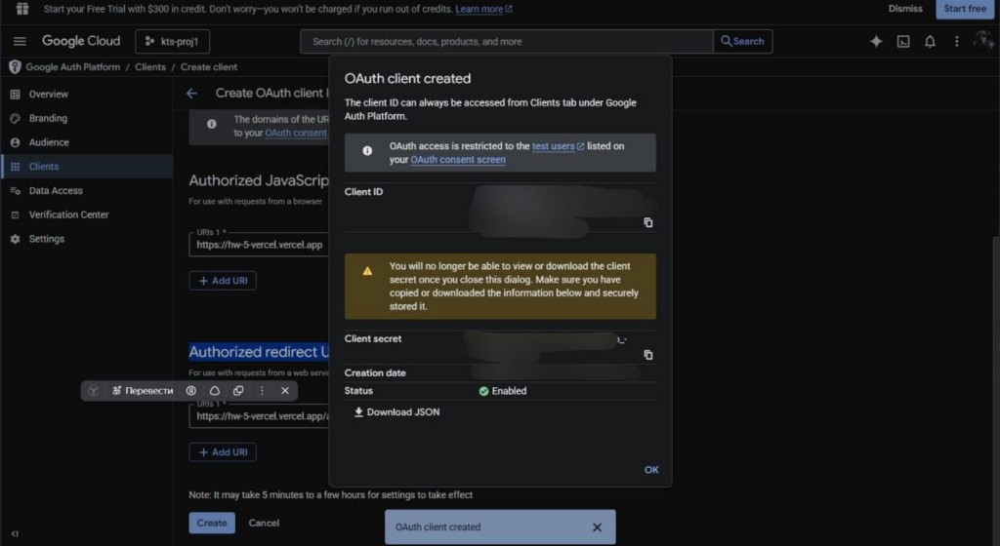

# E-commerce Next.js

Ориг репо: [https://github.com/qihed/hw](https://github.com/qihed/hw)

Ссылка на вертель (Vercel): [https://hw-5-vercel.vercel.app/](https://hw-5-vercel.vercel.app/)

---

**Фишки проекта**

1. **Мини-виджет для сравнения цен** — реализован на Document Picture-in-Picture (PiP). Окно остаётся поверх вкладок, можно листать другие сайты или просчитывать смету на обновку своей квартиры удобно и не бегая между вкладками. Минус: API `documentPictureInPicture` не поддерживается в Safari и Firefox, только в Chromium-браузерах, эплы не делают из точки зрения безопасности, фоксы +- тоже. Инструменты для кроссплатформерности — Tauri и Electron. Electron слишком тяжёлый, а Tauri умеет только статичные страницы (SSG), то есть пришлось бы переписывать роутинг, навигацию и всё динамическое от React/Next.js. В итоге решил не париться и показывать этот функционал только на Chromium.

2. **Поиск, фильтрация по категориям и по цене** — всё есть. Фильтрация по цене написана вручную (Strapi её не отдаёт), логика в `src/app/products/getProductsServer.ts` — функция `filterByPrice`.

3. **Страницы** — категории, о нас, профиль, заказы, корзина.

4. **Регистрация и аутентификация через Strapi** — логин/регистрация работают. Хотел добавить вход через Google по [этой статье](https://dev.to/refine/nextauth-usage-for-google-and-github-authentications-in-nextjs-46am), но в Strapi нет эндпойнта под Google, а полностью тащить всё через NextAuth — отдельная история. Ключи для Google OAuth добросовестно получил, лежат на будущее.

**Планы:** доработать анимации, UI/UX и логику скидок. Также сделать темную тему



---

Next.js 16 приложение (App Router) для интернет-магазина с MobX, SCSS-модулями и серверной загрузкой данных.

Ниже — скрипты запуска/сборки, переменные окружения и инструкция по деплою.

## Запуск и сборка

```bash
# Установка зависимостей
yarn install

# Режим разработки
yarn dev

# Production-сборка
yarn build

# Запуск production-сервера (после yarn build)
yarn start

# Линтинг
yarn lint
```

Откройте [http://localhost:3000](http://localhost:3000) в браузере.

## Переменные окружения

- **Серверные** (без префикса `NEXT_PUBLIC_`) — доступны только на сервере (Server Components, API routes, Server Actions). Используйте их для секретов и ключей API.
- **Публичные** (с префиксом `NEXT_PUBLIC_`) — попадают в браузер. Используйте только для данных, которые допустимо показывать на клиенте.

Для локальной разработки создайте файл `.env.local` в корне проекта:

| Переменная | Описание | Обязательна |
|------------|----------|-------------|
| `NEXT_PUBLIC_API_URL` | Базовый URL API (например, Strapi). По умолчанию используется `https://front-school-strapi.ktsdev.ru/api` | Нет |

Пример:

```env
NEXT_PUBLIC_API_URL=https://front-school-strapi.ktsdev.ru/api
```

Для деплоя на Vercel задайте те же переменные в настройках проекта.

## Деплой на Vercel

1. Подключите репозиторий к [Vercel](https://vercel.com), выберите фреймворк Next.js.
2. Укажите переменные окружения в настройках проекта.
3. Убедитесь, что билд проходит и приложение открывается.

**Production:** после деплоя добавьте сюда ссылку на приложение (например, `https://your-project.vercel.app`).

**Репозиторий:** ссылка на исходный код (если хранится отдельно от деплоя).

## Документация

- [Next.js](https://nextjs.org/docs)
- [Деплой Next.js на Vercel](https://nextjs.org/docs/app/building-your-application/deploying)


